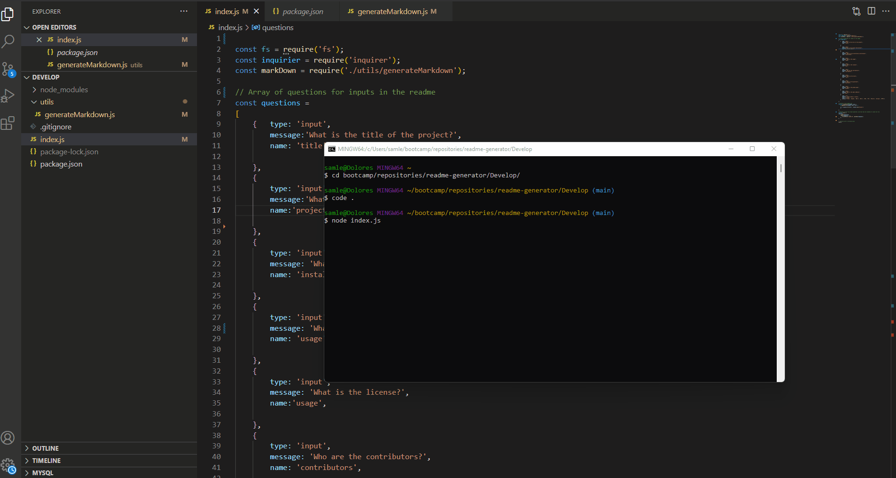

# <ReadMe Generator>

## Description

This project is a readme generator to help create readme files for future projects. The project demonstrates the usages of Node.js. With this readme generator, this will allow for a quick creation of readme files to help with project workflow efficiency and time management. 

## Installation

The readme generator can be found at my github page:
https://github.com/samlee088/readme-generator

Project additionally requires ‘Inquirer’ NPM

## Usage

## Credits

NA

## License

NA
